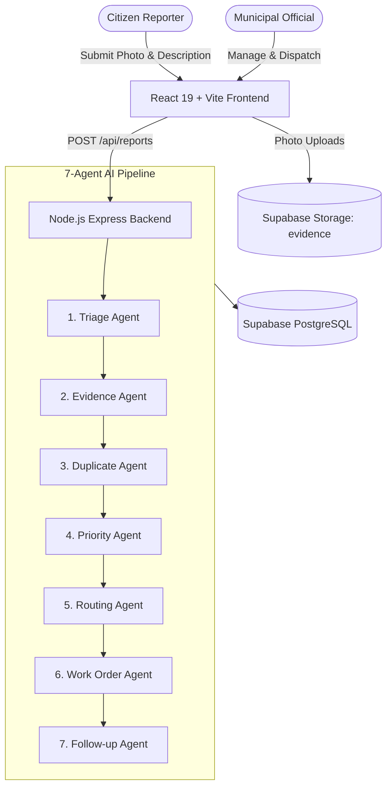

# GreenWatch AI 🌿

> **AI-coordinated civic engagement & municipal operations platform**  
> *Philosophy: "AI suggested · human approved"*

GreenWatch AI empowers citizens to report environmental and municipal issues (illegal garbage dumping, fallen/damaged trees, water leakage/wastage, damaged plants, dirty parks, blocked green areas) while coordinating municipal departments through an autonomous 7-agent AI pipeline.

[](https://vitejs.dev/)
[](https://react.dev/)
[](https://tailwindcss.com/)
[](https://supabase.com/)
[](https://vitest.dev/)

---

## Team

| Member | Role |
|---|---|
| ZAFRAN ALI | Team Leader, Core Developer & Deployment |
| Tayyab Irshad | Frontend Developer |
| Samia Akram | Slides / Presentation Design |
| Iman Hameed | Presenter |
| Tooba Nasir | PRD (Product Requirements Document) |

Built for Pak Angels Chorat 11 Final Hackathon.

---

## 🚀 Key Features

- **Citizen Issue Reporting (No Login Required)**: Submit reports with description, photos, and precise geolocation. Instant tracking via human-friendly reference numbers (`GW-XXXX`).
- **Autonomous 7-Agent AI Pipeline**:
  1. **Triage Agent**: Classifies issue category and semantic confidence score.
  2. **Evidence Agent**: Analyzes photo quality and verifies alignment with report text.
  3. **Duplicate Detection Agent**: Scans recent neighborhood reports within geographic and semantic thresholds.
  4. **Priority Agent**: Assesses public safety, health hazards, and infrastructure risks to set priority (`High`, `Medium`, `Low`).
  5. **Department Routing Agent**: Directs issues to the appropriate municipal department (*Sanitation*, *Parks & Forestry*, *Water Utility*, *Public Works*).
  6. **Work Order Agent**: Synthesizes structured work orders (`WO-XXXX`) with estimated SLAs and equipment needs.
  7. **Follow-up Agent**: Monitors overdue SLAs and automatically drafts escalations.
- **Municipal Operations Dashboard**: Live interactive queue, multi-dimensional filters, SLA tracking, trend analytics, and activity timelines.
- **Supabase Cloud Integration**: Real-time Postgres database, Row Level Security (RLS) policies, and Cloud Storage for evidence photos.

---

## 🏛️ System Architecture



---

## 🛠️ Tech Stack

- **Frontend**: React 19, Vite 7, TailwindCSS v4, React Router v7, Lucide Icons, Recharts
- **Backend**: Node.js, Express, Zod (runtime validation), JSON Web Tokens, BCrypt
- **Database & Storage**: Supabase (PostgreSQL with RLS), Supabase Storage (`evidence` bucket), Prisma ORM
- **Testing**: Vitest, Supertest (32/32 tests passing)
- **Documentation**: OpenAPI 3.1.0 specification (`docs/api/openapi.yaml`)

---

## ⚡ Quick Start

### 1. Prerequisites
- Node.js 18+
- npm or pnpm

### 2. Installation

```bash
# Clone the repository
git clone https://github.com/zafran-coder/greenwatch.ai.git
cd greenwatch.ai

# Install frontend dependencies
npm install

# Install backend dependencies
cd server
npm install
cd ..
```

### 3. Environment Configuration

Frontend `.env` (the only frontend variable):
```env
# In development, leave blank to use Vite proxy (/api -> http://localhost:4000)
# In production, set to your backend API URL
VITE_API_URL=
```

Backend `server/.env`:
See `server/.env.example` for all configurable variables.

#### Environment Variables Reference

**Backend (`server/.env` / Render Web Service):**
| Variable | Required | Default / Example | Purpose |
|---|---|---|---|
| `PORT` | No | `4000` | Port for Express HTTP listener |
| `NODE_ENV` | Yes | `development` / `production` | Runtime mode |
| `FRONTEND_URL` | Production | `https://your-app.onrender.com` | Allowed CORS origins (comma-separated) |
| `COOKIE_SECRET` | Yes | random 32-char string | Cookie signing secret |
| `DATABASE_URL` | Optional | `postgresql://...` | Direct PostgreSQL connection string |
| `SUPABASE_URL` | Yes | `https://[ref].supabase.co` | Supabase project URL |
| `SUPABASE_ANON_KEY` | Yes | `eyJ...` | Supabase anonymous API key |
| `SUPABASE_SERVICE_ROLE_KEY` | Recommended | `eyJ...` | Supabase service-role secret key |
| `SUPABASE_STORAGE_BUCKET`| No | `evidence` | Evidence photos storage bucket |
| `STORAGE_DRIVER` | No | `supabase` (or `local`) | Active storage backend |
| `JWT_SECRET` | Yes | random 32-char string | Admin auth token secret |
| `ADMIN_EMAIL` | Yes | `admin@greenwatch.gov` | Official admin email |
| `ADMIN_PASSWORD` | Yes | Secure password | Official admin password |
| `CRON_SECRET` | Yes | Random secret string | Protects `/api/jobs/run` |
| `GEMINI_API_KEY` | Optional | `AIza...` | Google Gemini multimodal API key |

**Frontend (`.env` / Render Static Site):**
| Variable | Required | Purpose |
|---|---|---|
| `VITE_API_URL` | Production only | Backend API base URL (e.g. `https://greenwatch-api.onrender.com`) |

### 4. Database Setup & Seed

1. Run the database migration script [supabase_schema.sql](supabase_schema.sql) in your Supabase SQL editor.
2. Run the idempotent seed once:
```bash
npm run seed
```

### 5. Running the Application Locally

```bash
# Terminal 1: Backend API
cd server
npm run dev

# Terminal 2: Frontend App
npm run dev
```

For production deployment instructions on Render, see [DEPLOY.md](DEPLOY.md).

---

## 🧪 Testing

Run backend unit and integration test suite:
```bash
cd server
npm test
```

Build production bundle:
```bash
npm run build
```

---

## 📖 API Documentation

The full OpenAPI 3.1.0 specification is available at [docs/api/openapi.yaml](docs/api/openapi.yaml).

| Endpoint | Method | Description |
|---|---|---|
| `/api/reports` | `POST` | Submit report & trigger 7-agent pipeline |
| `/api/reports` | `GET` | List & filter reports |
| `/api/reports/:id` | `GET` | Get report by ID |
| `/api/reports/track/:ref` | `GET` | Public citizen report tracking by `GW-XXXX` |
| `/api/reports/:id` | `PATCH` | Update report status, priority, or assignee |
| `/api/analytics` | `GET` | Municipal KPI metrics and 14-day trends |
| `/api/supabase-status` | `GET` | Live connectivity and schema status check |

---

## 🔒 Security & Privacy

- **Zero-PII Citizen Reporting**: Citizens track issues via reference IDs (`GW-XXXX`) with no accounts or identity tracking.
- **Row Level Security (RLS)**: PostgreSQL-level policies guard sensitive municipal data.
- **Fail-Safe AI**: All AI agent outputs are validated with Zod schemas and backed by deterministic heuristics.

---

## 📄 License

MIT License. Designed and developed for modern municipal operations.
