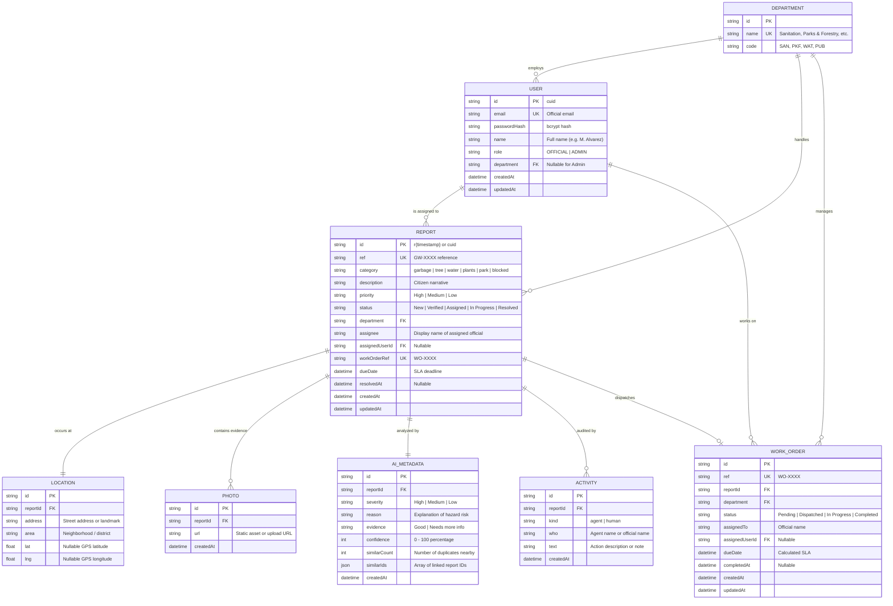
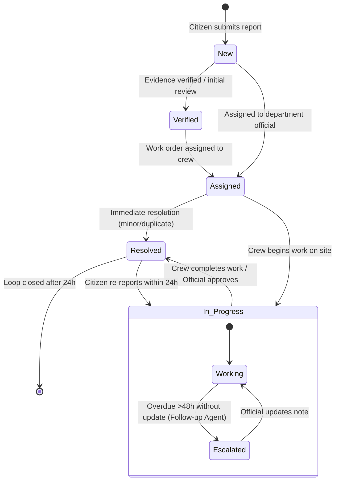
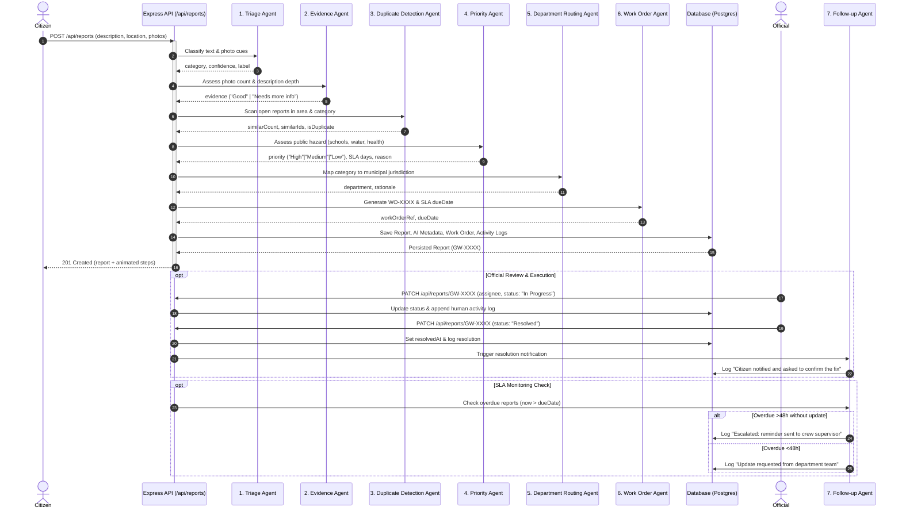

# GreenWatch AI — System Architecture Specification

## 1. Architectural Philosophy
GreenWatch AI is an AI-coordinated civic engagement and municipal operations platform operating under the principle **"AI suggested · human approved"**.
- Citizens can report environmental hazards without accounts and track issues using human-readable reference IDs (`GW-XXXX`).
- AI agents run an autonomous pipeline to classify, assess evidence, identify duplicates, evaluate hazard risk, route to municipal departments, and generate work orders.
- City officials maintain final authority over work orders, crew dispatch, SLA adjustments, and resolution sign-offs.

---

## 2. Entity-Relationship Diagram (ERD)



---

## 3. Server Folder Structure (`/server`)

```text
/server
├── .env.example              # Template environment variables (committed)
├── .env                      # Local environment secrets (gitignored)
├── .gitignore                # Git exclusions
├── docker-compose.yml        # PostgreSQL 16 local container infrastructure
├── package.json              # Server dependencies and lifecycle scripts
├── vitest.config.js          # Vitest unit & integration test configuration
├── prisma/
│   ├── schema.prisma         # Database schema (PostgreSQL provider)
│   └── seed.js               # Database seeder (12 municipal reports & accounts)
├── src/
│   ├── app.js                # Express application setup, middlewares, routes
│   ├── server.js             # HTTP listener and graceful shutdown
│   ├── config.js             # Validated environment configuration
│   ├── agents/               # Modular AI Agent Pipeline
│   │   ├── triageAgent.js    # Triage Agent (category & confidence)
│   │   ├── evidenceAgent.js  # Evidence Agent (photos & detail quality)
│   │   ├── duplicateAgent.js # Duplicate Detection (spatial & category scan)
│   │   ├── priorityAgent.js  # Priority Agent (hazard risk & SLA days)
│   │   ├── routingAgent.js   # Department Routing (municipal jurisdiction)
│   │   ├── workOrderAgent.js # Work Order Dispatcher (WO-XXXX & due date)
│   │   ├── followUpAgent.js  # Follow-up Agent (overdue escalation & confirmation)
│   │   └── pipeline.js       # Orchestrator coordinating all 7 stages
│   ├── db/
│   │   ├── client.js         # Unified Prisma database access + resilient fallback
│   │   └── seedData.js       # Canonical seed records matching frontend mock data
│   ├── lib/
│   │   └── errors.js         # AppError classes (BadRequest, NotFound, etc.)
│   ├── middleware/
│   │   ├── auth.js           # JWT verification & role-based access control
│   │   ├── errorHandler.js   # Unified { error: { code, message, details } } handler
│   │   └── validate.js       # Zod schema validation middleware
│   ├── routes/
│   │   ├── auth.js           # /api/auth endpoints (login, register, me)
│   │   ├── reports.js        # /api/reports endpoints (CRUD, tracking, notes)
│   │   ├── analytics.js      # /api/analytics endpoints (KPIs, trends, rates)
│   │   └── health.js         # /api/health endpoint
│   ├── schemas/
│   │   ├── authSchema.js     # Zod input schemas for authentication
│   │   └── reportSchema.js   # Zod input schemas for report submissions & queries
│   └── services/
│       ├── authService.js    # JWT generation, bcrypt verification
│       ├── reportService.js  # Pipeline execution, report queries & updates
│       └── analyticsService.js# Metric aggregation & SLA calculations
└── tests/
    ├── setup.js              # Test database reset before each test
    ├── agents.test.js        # Unit tests for all 7 agents and fallback paths
    ├── auth.test.js          # Authentication & JWT test cases
    ├── reports.test.js       # Report lifecycle, validation, and filter tests
    └── analytics.test.js     # Analytics, KPI, and health check tests
```

---

## 4. Status State Machine & Allowed Transitions



### Transition Guard Rules:
1. **Citizen Submission**: Always enters state `Assigned` (when AI pipeline identifies category & department) or `New` (if manual triage required).
2. **Assigning an Official**: If report is `New` or `Verified`, assigning an official automatically transitions status to `Assigned`.
3. **Work Execution**: Official marks status `In Progress` when field crew is dispatched or on site.
4. **Resolution**: Marking status `Resolved` records `resolvedAt` timestamp and automatically triggers the **Follow-up Agent** to notify the citizen for confirmation.
5. **Reopening**: If citizen disputes resolution within 24 hours, official can return ticket to `In Progress`. After 24h of silence, the loop is permanently closed.

---

## 5. Agent Pipeline Sequence Diagram


